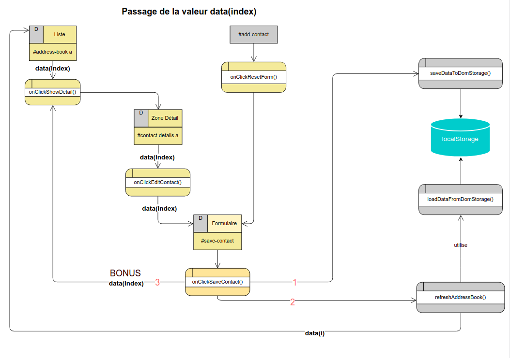

# Carnet d'adresse

## Nouvelles compétences

### 1. Développer une application de type CRUD entièrement côté client
### 2. Exploiter l'API Web Storage pour stocker des données localement dans le navigateur 
### 3. Exploiter le format JSON pour stocker des données complexes JavaScript sous forme d'une chaîne de caractères
### 4. Utiliser la librairie javaScript jQuery afin de simplifier la manipulation du DOM 
  * Méthode de sélection des éléments HTML avec jQuery
  * Installer un gestionnaire d'événement avec jQuery
  * Délégation d'événement à un élément parent afin de pouvoir installer un gestionnaire d'événement sur un élément qui n'existe pas au chargement du DOM
  * Manipuler le DOM (insérer des éléments, modifier les attributs, etc)
  * Stocker des valeurs sur les éléments HTML 

## Mémo

### LocalStorage

#### Sauvegarder un item
      window.localStorage.setItem('name','data');

#### Récupérer un item
      window.localStorage.getItem('name');

### JSON

#### Convertir une valeur JavaScript en chaîne JSON
      jsonData = JSON.stringify(data);

#### Traduire JSON en javaScript
      data = JSON.parse(jsonData);

### jQuery

#### Cibler un élément du DOM
      $('sélecteur CSS')

#### Créer un nouvel élément
      $('<balise>')

#### Manipuler la classe
      $('selecteur CSS').addClass('nom de la classe');
      $('selecteur CSS').toggleClass('nom de la classe');
      $('selecteur CSS').removeClass('nom de la classe');

#### Manipuler les attributs
      $('selecteur CSS').attr('attribut','valeur');

#### Manipuler le contenu
      $('selecteur CSS').text();

#### Valeur d'un champ de formulaire
      $('selecteur CSS').val();

#### Insérer un élément dans un autre
      var new = $('<balise>');
      // Au début
      $('selecteur CSS du parent').prepend(new);
      // A la fin
      $('selecteur CSS du parent').append(new);

#### Gestionnaire d'événement
      $('selecteur CSS du déclencheur').on('event', function(){});

#### Délégation d'événement
      $(document).on('event', 'selecteur CSS du déclencheur', function(){});

#### Appliquer une fonction d'effet : exemples
      // Cacher un élément en 500ms
      $('selecteur CSS').hide(500);

      // Afficher/Cacher un élément avec effet de déroulé
      $('selecteur CSS').slideToggle();

#### Associer une valeur spécifique à un élément
      $(elt).data('foo', 'une valeur');
      // Récupérer la valeur stockée
      var foo = $(elt).data('foo');

## Ressources externes

* [Web Storage API](https://developer.mozilla.org/fr/docs/Web/API/Web_Storage_API)
* [Le format JSON](https://www.alsacreations.com/article/lire/1675-json-stockage-leger-pratique-donnees-multitypes.html)
* [jQuery](https://api.jquery.com/)
  * [jQuery animations](https://api.jquery.com/category/effects/)
  * [jQuery.data()](https://api.jquery.com/jQuery.data/#jQuery-data-element-key-value)
  * [trigger()](https://api.jquery.com/trigger/#trigger-eventType-extraParameters)
  * [.eq()](https://api.jquery.com/eq/#eq-index)
* [L'attribut HTML5 data-](https://www.alsacreations.com/article/lire/1397-html5-attribut-data-dataset.html)
